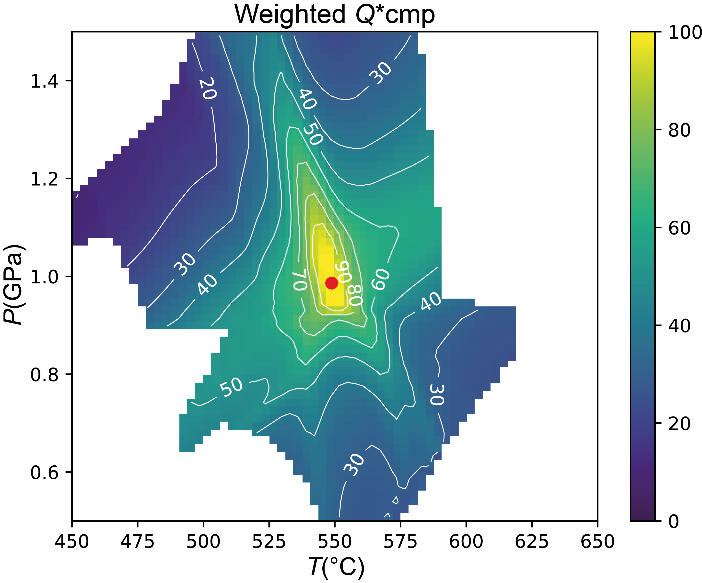
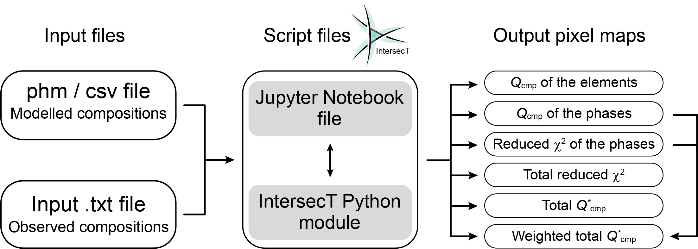

# IntersecT

<p align="center">
  
</p>

<p align="center">
  
  
</p>

IntersecT is an open-source Python package for statistically quantifying the quality of fit in isopleth thermobarometry using thermodynamic model outputs from Perple_X and MAGEMin. The package applies the quality factor of composition (***Q*cmp**) methodology as described in Duesterhoeft and Lanari (2020, https://doi.org/10.1111/jmg.12538), enabling propagation of measurement uncertainty in compositional constraints. Additionally, IntersecT applies reduced χ² statistics to assess the weight of considered phases, allowing down-weighting of outlier data due to model inaccuracies or incorrect assumptions such as disequilibrium features.

The implementation uses standardized mineral nomenclature following Warr (2021, https://doi.org/10.1180/mgm.2021.43) with automatic phase name resolution from software-specific abbreviations. Compositional discrimination is applied to solid solution series based on stoichiometric criteria. The approach provides a quantitative framework to improve interpretation of isopleth thermobarometry results while considering compositional uncertainties in measured mineral compositions (Nerone et al., 2025, https://doi.org/10.1016/j.cageo.2025.105949).

<p align="center">
  
  <br>
  <em>Example output: Weighted quality factor map identifying optimal conditions for a garnet-bearing metapelite assemblage. The red dot marks the location of maximum Q*cmp. Taken from Nerone et al. (2025).</em>
</p>

## Workflow Overview

IntersecT integrates thermodynamic model outputs with measured mineral compositions through a structured workflow implemented in a Jupyter Notebook interface. The system parses compositional data from model calculations, resolves phase names to standard nomenclature, applies compositional discrimination to solid solution series to identify specific endmember compositions based on chemical criteria, and calculates quality factors with statistical weighting to identify optimal equilibration conditions.

<p align="center">
  
  <br>
  <em>Workflow structure showing integration of thermodynamic model output and measured compositions to generate quality factor maps and statistical estimates.</em>
</p>

## Installation

IntersecT requires Python 3.9 or higher. Installation through pip handles all dependencies including numpy, pandas, and matplotlib.
```bash
pip install pyIntersecT
```

For use with Jupyter notebooks, install JupyterLab or Jupyter Notebook:
```bash
pip install jupyterlab
```

Alternatively, install the classic notebook interface:
```bash
pip install notebook
```

## Quick Start

Download the IntersecT Jupyter notebook from the repository and execute it in your Python environment. The notebook provides step-by-step guidance through the complete analysis workflow.
```python
from pyIntersecT import IntersecT

# Initialize analysis object
InT = IntersecT.QualityFactorAnalysis.from_default_symbols()

# Configure output directory
InT.set_output_directory()

# Load thermodynamic model output
InT.load_model_output()

# Auto-detect and configure coordinate system
x_coord, y_coord = InT.suggest_plot_coordinates()
InT.set_plot_coordinates(x_coord, y_coord)

# Load measured mineral compositions
InT.import_analytical_compo()

# Build integrated data table
InT.build_intersect_table()

# Execute quality factor calculations
InT.Qcmp_elem()
Qcmp_phase_tot = InT.Qcmp_phase()
redchi2_phase = InT.redchi2_phase()

# Generate final best fit estimates
InT.Qcmp_tot(Qcmp_phase_tot, redchi2_phase)
InT.Qcmp_tot_weight(Qcmp_phase_tot, redchi2_phase)
```

## Methodology

IntersecT consists of a main module containing subroutines and a Jupyter Notebook file structured into distinct code cells for different calculations. This structure allows separate evaluation of the quality factor for single elements within phases, the quality factor of each phase, and the quality factor of the whole input assemblage. The separation is necessary to trace back the presence of metastable phases or limitations in the model.

The total quality factor Q*cmp is calculated as the weighted sum of individual phase quality factors. This value is plotted only for pressure-temperature-composition conditions where all phases in the assumed equilibrium assemblage are predicted to be stable by the model.

Read the instructions in the Jupyter notebook and run the code cells (**Shift+Enter** when positioned in the cell, or **Run all**)

## Input Requirements

### Thermodynamic Model Output

Perple_X users should employ WERAMI option 36 to extract system and phase properties. Compositional output must be configured for atoms per formula unit by setting composition_system and composition_phase to "mol" in the perplex_option file. This allows the uncertainty in measured compositions to be propagated following the approach of Bingo-Antidote. Output will be saved as .phm format.

<p align="center">
  
  <br>
  <em>Perple_X configuration showing composition_system and composition_phase set to "mol" for proper compositional output and workflow for creating the WERAMI output file.</em>
</p>

MAGEMin users must calculate the phase diagrams using no refinement levels and increasing the initial grid subdivision to the desired one. This allows for interpreting the grid and for having enough resolution inside the phase fields. Users should then save calculation results using Diagram > Informations > Save all (csv file). Version 1.3.4 or later is required to ensure proper file formatting.

<p align="center">
  
  <br>
  <em>MAGEMin interface showing the calculation and save workflow for exporting results.</em>
</p>

### Measured Compositions

Measured mineral compositions must be provided in a tab-delimited text file. Compositions should be expressed in atoms per formula unit using appropriate cation site assignments and oxygen basis. Phase names must follow Warr (2021) standard abbreviations, e.g., Grt for garnet, Omp for omphacite, Ms for muscovite, Bt for biotite, Chl for chlorite, Pl for plagioclase.

<p align="center">
  
  <br>
  <em>Structure of the measured composition input file showing the six-row format with phase-element identifiers, observed values, uncertainties, analytical technique, and colormap specification.</em>
</p>

The file follows a specific six-row structure.

**Row 1** specifies element identifiers using Phase_Element format where phase names follow Warr (2021) abbreviations. Consult mineral_symbols.toml to recognise abbreviations and their mappings.

**Row 2** provides observed compositional values in atoms per formula unit corresponding to each element specified in row 1.

**Row 3** specifies analytical uncertainties as numerical values representing one standard deviation, or a dash to trigger automatic uncertainty calculation based on the analytical technique specified in row 4.

**Row 4** identifies the analytical technique: EDS, WDS map, or WDS spot. This determines the appropriate uncertainty model when explicit uncertainties are not provided.

**Rows 5** should remain blank to provide visual separation between different sections of the input file.

**Row 6** specifies the matplotlib colormap for visualization. Perceptually uniform colormaps such as viridis, plasma, inferno, or magma are recommended as they maintain consistent brightness gradients and remain readable when converted to grayscale.

Lines beginning with hash symbols are treated as comments and ignored during parsing, allowing documentation of sample information and analytical conditions.

## Output and Interpretation

The system generates element-specific quality factor maps, phase-specific maps integrating all measured elements within each mineral, and reduced χ² distributions assessing statistical fit. All visualizations are saved as vector PDF files with contours at appropriate intervals.

<p align="center">
  
  <br>
  <em>Representative outputs: (a) element-specific quality factor for garnet Ca, (b) phase-specific quality factor for garnet integrating all measured elements, (c) reduced χ² for the complete assemblage for pure inversion, (d) weighted total quality factor identifying optimal P-T conditions. Modified after Nerone et al. (2025).</em>
</p>

The Qcmp value for each element evaluates the distance from the best isopleth, with 0% indicating isopleths are outside 6σ and 100% indicating isopleths are within 1σ of the observed composition. The Qcmp value of a phase includes contributions from all considered elements. The surface trend on the two-dimensional space of the phase Qcmp provides insight into the behaviour of elements and helps visualize correlations.

The weighted total quality factor map provides the final best fit estimate. The optimal conditions are marked at the location of maximum weighted quality factor. This weighting scheme emphasizes phases demonstrating higher statistical agreement while down-weighting those exhibiting misfit. Because several pixels may reach 100% Q*cmp in theoretical examples, the best fit is taken at the centre of mass of these pixels, though this is not a common feature in natural rocks and should be taked as a proxy.

Complete calculation logs are written to log_IntersecT.txt in the output directory, recording coordinate ranges, compositional data, calculated uncertainties, quality factor maxima with locations, reduced χ² minima, weighting factors, and final best fit estimates.

## Application

The quality factor approach helps visualize discrepancies resulting from model inaccuracies or incorrect assumptions such as disequilibrium features. The formulation of the Qcmp allows visualization of the behaviour of each element in each phase and their contribution to the overall quality of fit. This is invaluable for understanding where problems exist and tracing possible disequilibrium scenarios.

The approach can also help interpret how phase equilibrium experiments reproduce observed compositions for magmatic and metamorphic systems, either to validate experiments or to check the accuracy of solution models. Three case studies demonstrating application to theoretical examples, metapelites from Barrovian sequences, and ultra-high pressure metabasites with coesite are described in Nerone et al. (2025).

The comparison between weighted and unweighted total quality factor diagnoses whether phase-specific statistical reliabilities vary substantially across the assemblage. Minimal differences indicate all phases exhibit similar reliability, while substantial differences suggest some phases show much better agreement with the weighting scheme appropriately emphasizing reliable constraints.

## Documentation

Technical documentation describing implementation of parsing algorithms, phase name resolution, and solvus discrimination logic is provided in [docs/TECHNICAL.md](docs/TECHNICAL.md). The documentation covers the architecture of data parsing, phase identification and quality factor calculations.

Practical guidance for preparing input files, executing analyses, and interpreting results is provided in [docs/USER_GUIDE.md](docs/USER_GUIDE.md). The guide includes detailed instructions for configuring Perple_X and MAGEMin outputs, preparing measured composition files, and troubleshooting common issues encountered during analysis.

## Citation

When using IntersecT in research, cite the software paper:

Nerone, S., Lanari, P., Dominguez, H., Forshaw, J.B., Groppo, C., Rolfo, F., 2025. IntersecT: a Python script for quantitative isopleth thermobarometry of equilibrium and disequilibrium systems. Computers & Geosciences 202, 105949. https://doi.org/10.1016/j.cageo.2025.105949

Additionally cite the original quality factor methodology:

Duesterhoeft, E., Lanari, P., 2020. Iterative thermodynamic modelling—Part 1: a theoretical scoring technique and a computer program (Bingo-Antidote). Journal of Metamorphic Geology 38, 527-551. https://doi.org/10.1111/jmg.12538

And the standardized mineral nomenclature system:

Warr, L.N., 2021. IMA–CNMNC approved mineral symbols. Mineralogical Magazine 85, 291-320. https://doi.org/10.1180/mgm.2021.43

## Code Availability

The source code is available at https://github.com/neoscalc/IntersecT. The program requires Python 3.9 or higher and uses Jupyter Notebook for interactive calculations. Example input files demonstrating proper formatting for both Perple_X and MAGEMin workflows are available in the repository's example directory at https://github.com/neoscalc/IntersecT/tree/main/example.

## License

IntersecT is distributed under GNU General Public License v3.0. See the LICENSE file in the repository for complete terms and conditions.