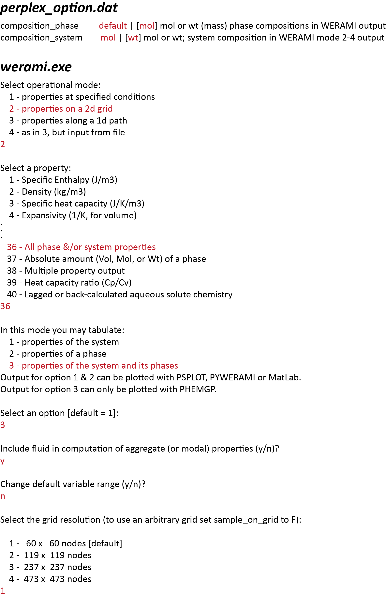
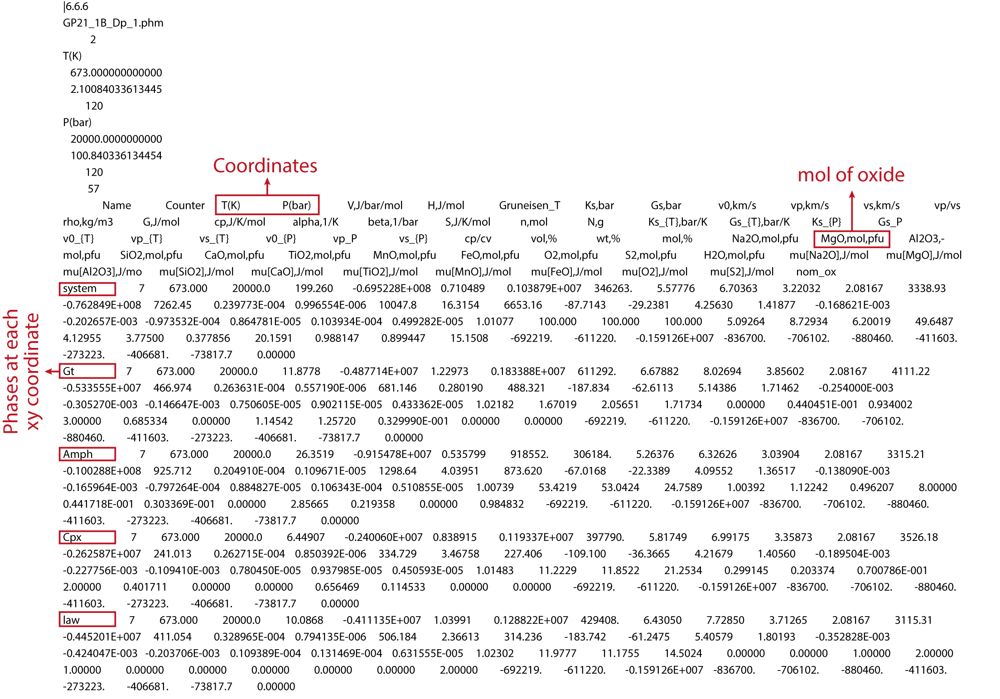
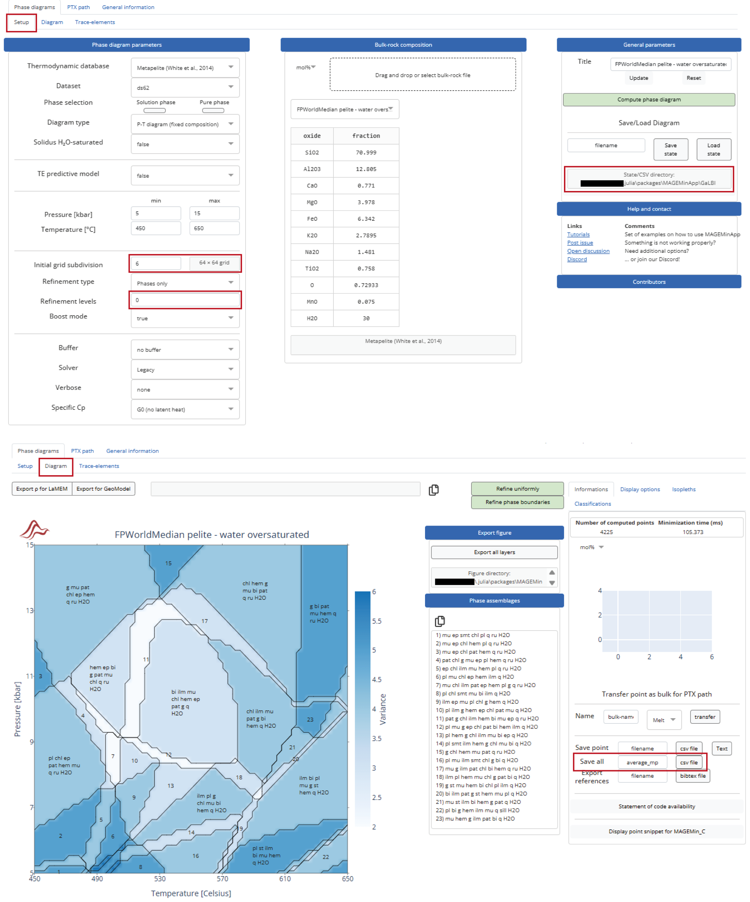
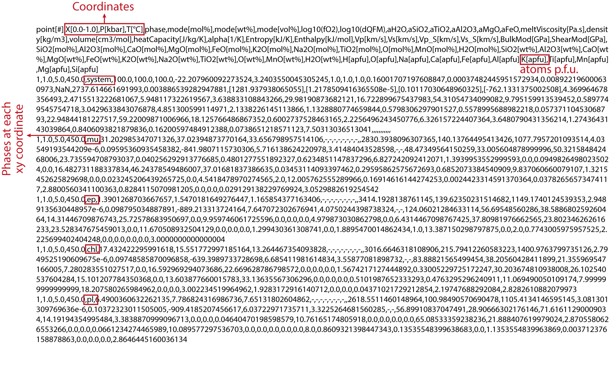
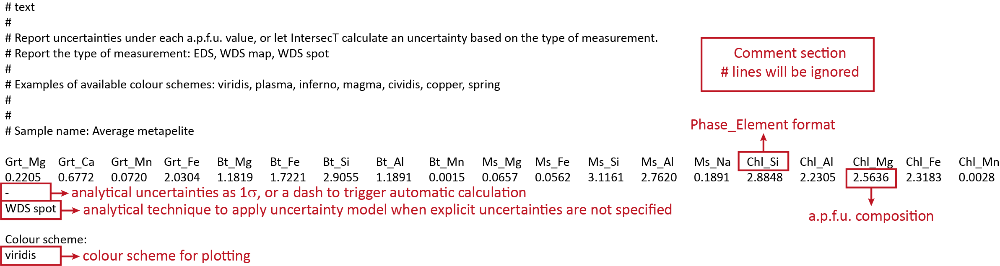
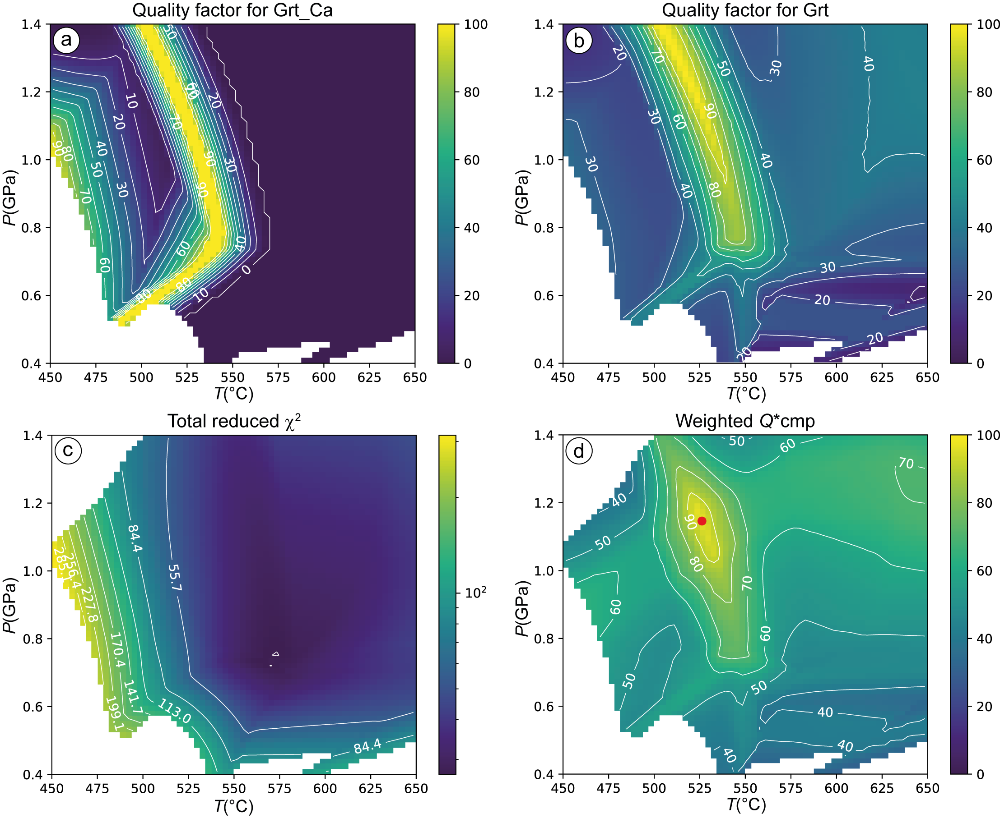

# IntersecT User Guide

This guide provides instructions for preparing input files, executing analyses, and interpreting results from IntersecT. The methodology and implementation follow Nerone et al. (2025, https://doi.org/10.1016/j.cageo.2025.105949). Familiarity with thermodynamic modeling using Perple_X or MAGEMin is assumed.

## Preparing Thermodynamic Model Output

The quality factor methodology requires compositional data expressed in atoms per formula unit to enable proper uncertainty propagation following the approach of Bingo-Antidote (Duesterhoeft and Lanari, 2020). Different software packages require specific configuration procedures.

### Perple_X Configuration

Configure the perplex_option file before running calculations to ensure WERAMI extracts compositions in the required format. Set composition_system and composition_phase to "mol" rather than "wt" to request molar proportions. This configuration ensures WERAMI output expresses phase compositions as moles of oxide components per formula unit, which the parsing system converts to atoms per formula unit by applying appropriate stoichiometric coefficients.

After completing BUILD and VERTEX calculations, run WERAMI and select option 36 for properties of the system and its phases. Consider the fluid if appropriate. This option generates output including both system-level properties and individual phase compositions across the specified pressure-temperature-composition grid. Configure the WERAMI grid to span the pressure-temperature range of interest with sufficient resolution. A typical grid uses 50 to 100 points in each direction depending on diagram complexity.

<p align="center">
  
  <br>
  <em>Perple_X configuration showing composition_system and composition_phase set to "mol" for proper compositional output and workflow for creating the WERAMI output file.</em>
</p>

The WERAMI output will be saved with .phm extension. The file must contain coordinate columns, a phase name column, and composition columns for all elements in each stable phase. Manual editing is unnecessary and should be avoided to prevent formatting inconsistencies.

<p align="center">
  
  <br>
  <em>Example of formatted Perple_X WERAMI .phm output showing coordinate columns and phase compositions.</em>
</p>

### MAGEMin Configuration

Use MAGEMin version 1.3.4 or later to ensure proper file formatting. In the graphical interface, calculate setting refinement levels to zero and increasing the initial grid resolution to desired. The final calculation must have a uniform grid. After completing a calculation in the graphical interface, save results using Diagram > Informations > Save all. This generates a CSV file containing system properties, stable phase assemblages, and detailed phase compositions at each calculation point.

Manual editing is unnecessary and should be avoided to prevent formatting inconsistencies.

MAGEMin calculations with variable bulk composition generate files with three coordinate columns representing composition, pressure, and temperature. The coordinate detection system recognizes this configuration and applies structural analysis to determine appropriate plotting axes.

<p align="center">
  
  <br>
  <em>MAGEMin interface showing the calculation and save workflow for exporting results.</em>
</p>

The MAGEMin output will be saved with .csv extension. The file must contain coordinate columns, a phase name column, and composition columns for all elements in each stable phase. Manual editing is unnecessary and should be avoided to prevent formatting inconsistencies.

<p align="center">
  
  <br>
  <em>Example of formatted MAGEMin output showing coordinate columns and phase compositions.</em>
</p>

## Preparing Measured Composition Files

Measured mineral compositions must be provided in a tab-delimited text file following a specific row structure to enable unambiguous parsing. A template file is available in the repository's example directory at https://github.com/neoscalc/IntersecT/tree/main/example.

The first row contains element identifiers combining phase names with element symbols using underscore separation. Phase names must follow Warr (2021) abbreviations to ensure proper matching with resolved phase names from thermodynamic model output, e.g., Grt for garnet, Omp for omphacite, Ms for muscovite, Pg for paragonite, Bt for biotite, Chl for chlorite, Pl for plagioclase.

Example identifiers for a garnet-muscovite-biotite-plagioclase assemblage would include Grt_Mg, Grt_Fe, Grt_Ca, Grt_Mn, Ms_Si, Ms_Al, Ms_K, Ms_Mg, Bt_Mg, Bt_Fe, Bt_Si, Bt_K, Pl_Ca, Pl_Na, Pl_Al, Pl_Si. The specific elements chosen should reflect compositional variables that constrain pressure-temperature-composition conditions. Elements involved in substitutions in the solution models should be considered, depending on the selected chemical system, database and solution models.

<p align="center">
  
  <br>
  <em>Structure of the measured composition input file showing the six-row format with phase-element identifiers, observed values, uncertainties, analytical technique, and colormap specification.</em>
</p>

The second row provides observed compositional values corresponding to each element identifier in the first row. Values must be in atoms per formula unit calculated from oxide weight percentages using appropriate cation site assignments and oxygen basis. Different minerals use different oxygen bases: garnets typically use 12 oxygens, micas use 11 oxygens excluding hydroxyl, chlorite uses 14 oxygens, plagioclase uses 8 oxygens, and pyroxenes use 6 oxygens.

In cases of phases with variable compositions such as zoned phases or different generations, users should select the compositional domain that best represents the equilibrium assemblage based on microstructural relationships and mineral chemical investigations. Alternatively, an average composition can be used, though it might return less accurate results.

The third row specifies analytical uncertainties as numerical values or dashes triggering automatic calculation. When providing explicit uncertainties, values represent one standard deviation of the analytical measurement for each element, typically determined from counting statistics or repeat measurements on homogeneous standards. Uncertainties should reflect analytical precision rather than standard errors from multiple grain measurements, as the latter incorporate natural compositional variation.

The fourth row specifies analytical technique using EDS for energy dispersive spectroscopy, WDS map for wavelength-dispersive X-ray mapping, or WDS spot for wavelength-dispersive spot analyses. This specification determines which uncertainty model is applied during automatic calculation. EDS analyses exhibit higher uncertainties than WDS due to poorer spectral resolution and higher backgrounds, while WDS mapping shows intermediate precision due to lower beam currents and shorter dwell times.

The fifth row should remain blank to provide visual separation. The sixth row specifies the matplotlib colormap for visualization. Colormap selection affects interpretation of results. Perceptually uniform colormaps like viridis, plasma, inferno, and magma maintain consistent brightness gradients and remain readable in grayscale and remain interpretable for viewers with color vision deficiencies.

Lines beginning with hash symbols are treated as comments, allowing documentation of sample information, analytical conditions, and calculation parameters. Comment lines commonly document sample identification, location and geological context, peak metamorphic assemblage, analytical instrument and operating conditions, date of analysis, and references to related publications.

## Executing Analyses

Analysis execution follows a sequential workflow progressing from data loading through coordinate configuration to quality factor calculation and visualization. The workflow implements the structure shown in Fig. 1 of Nerone et al. (2025). File selection dialogs appear automatically when methods are called without explicit file paths.

**1.** Initialize a QualityFactorAnalysis object using from_default_symbols, which loads standard mineral nomenclature mappings from the included mineral_symbols.toml file. This file contains mappings from Perple_X and MAGEMin abbreviations to Warr (2021) standard nomenclature. The object persists throughout the analysis, accumulating data and intermediate results that later methods access through object attributes.

```python
from pyIntersecT import IntersecT
# Create a Quality Factor Analysis
InT = IntersecT.QualityFactorAnalysis.from_default_symbols()
```

**2.** Specify an **output directory** using set_output_directory. This opens a directory selection dialog and creates a log file in the chosen location. All subsequent processing writes informational messages to both console and log file, providing a permanent record of coordinate ranges, compositional data, calculated uncertainties, quality factor maxima with locations, reduced χ² minima, weighting factors, and final best fit estimates.

```python
# Configure output directory
InT.set_output_directory()
```

**3.** Load the **thermodynamic model output** using load_model_output. The method automatically detects file format, parses coordinate and compositional data, and identifies available coordinate columns. This method resolves phase names from software-specific abbreviations to Warr nomenclature, applies solvus discrimination to distinguish individual phases within solid solution series. A summary of renaming will be displayed and saved in the log file. Review this summary to confirm that the discrimination worked as intended before proceeding with the quality factor calculations. Processing may take several seconds for large files containing thousands of calculation points and dozens of stable phases.

```python
# Load thermodynamic model output
InT.load_model_output()
```

**4.** Obtain **coordinate suggestions** using suggest_plot_coordinates, which analyzes data structure to determine appropriate axis assignments. The method returns recommended names for horizontal and vertical axes based on which coordinates vary and their organizational patterns. For standard pressure-temperature diagrams, the return values will be temperature and pressure column names. For composition-variable diagrams, the return values will be composition and pressure or composition and temperature depending on calculation structure. Accept coordinate suggestions by passing them to set_plot_coordinates, or specify alternative coordinates if automatic detection yields unexpected results. This method extracts coordinate values from all calculation points, applies unit conversions to transform temperatures from K to °C and pressures from bar to GPa, and prints coordinate ranges to console and log file. Verify that reported ranges match expectations for the pressure-temperature-composition space covered by the calculation.

```python
# Auto-detect and configure coordinate system
x_coord, y_coord = InT.suggest_plot_coordinates()
InT.set_plot_coordinates(x_coord, y_coord)

# alternative: manually specify coordinates if needed
# InT.set_plot_coordinates("T[°C]", "P[kbar]")  # for T-P diagram
# InT.set_plot_coordinates("X[0.0-1.0]", "P[kbar]")  # for X-P diagram
```

**5.** Load **measured compositions** using import_analytical_compo. The method parses element identifiers, observed values, uncertainties, analytical technique, phase names, and colormap specification. If automatic uncertainty calculation was requested through dashes, the method computes uncertainties using the analytical technique specified and empirical relationships described in Nerone et al. (2025).

```python
# Load measured mineral compositions
InT.import_analytical_compo()
```

**6.** Build the **integrated data table** using build_intersect_table. This method searches model output for phases matching the observed assemblage, and extracts element values from matching phases while recording NaN for elements in absent phases. The resulting data table contains one row per calculation point with coordinate columns followed by composition columns for all observed phase-element combinations.

```python
# Build integrated data table
InT.build_intersect_table()
```

**7.** Execute **element-specific quality factor** calculations using Qcmp_elem. This computes quality factors for each individual element at each calculation point and generates maps showing spatial distribution of element-specific agreement. Each element produces a PDF file named Qcmp_PhaseName_Element.pdf showing quality factor as colored image overlaid with contours at 10% intervals. Regions of high quality factor indicate where the model accurately predicts observed composition for that element while accounting for analytical uncertainty. Calculate **phase-specific quality factors** using Qcmp_phase, which averages element-specific quality factors within each mineral. This generates one PDF per phase named Qcmp_PhaseName.pdf containing colored quality factor maps with contours at 10% intervals. Maximum quality factor value and its best fit location are printed to console and log file for each phase. The surface trend on the two-dimensional space of the phase quality factor provides insight into the behaviour of elements, making it easier to visualize correlations. Compute **reduced χ² statistics** using redchi2_phase for individual phases and redchi2_tot for the complete assemblage. These methods generate PDF files showing spatial distribution of χ² values with logarithmic color scaling and contour lines. Minimum χ² values and their locations are printed to console and log file. These statistics provide independent assessment of whether compositional discrepancies are consistent with analytical uncertainties or indicate systematic model-data disagreement.

```python
# Execute quality factor calculations
InT.Qcmp_elem()
Qcmp_phase_tot = InT.Qcmp_phase()
redchi2_phase = InT.redchi2_phase()
redchi2_allphases = InT.redchi2_tot()
```

**8.** Generate **unweighted total quality factors** using Qcmp_tot, which combines phase-specific quality factors with equal weights for all phases. The method creates Unweighted_Qcmp_tot.pdf showing colored quality factor with contours and a red marker at maximum location. Reduced χ² values for all phases at this maximum location are printed to console and log file. Calculate **weighted total quality factors** using Qcmp_tot_weight, which combines phase-specific quality factors with weights inversely proportional to minimum reduced χ². This produces Weighted_Qcmp_tot.pdf marking the final best fit conditions estimate with a red symbol at maximum weighted quality factor location. The weights assigned to each phase and reduced χ² values at optimal location are printed to console and log file. Because several pixels may reach 100% in theoretical examples, the best fit is taken at the centre of mass of these pixels, though this is not common in natural rocks and should be considered carefully.

```python
# Generate final best fit estimates
InT.Qcmp_tot(Qcmp_phase_tot, redchi2_phase)
InT.Qcmp_tot_weight(Qcmp_phase_tot, redchi2_phase)
```

## Interpreting Results

Quality factor maps show agreement between thermodynamic model predictions and observed mineral compositions with values from zero representing complete disagreement to one hundred representing perfect agreement within analytical uncertainty. Colored regions indicate spatial distribution across pressure-temperature space. Contour lines facilitate quantitative assessment of quality factor variations.

Low quality factor values suggest systematic compositional discrepancies potentially arising from disequilibrium, retrograde modification, compositional zoning, or inappropriate thermodynamic models. Comparison of phase-specific quality factors across different minerals reveals whether all phases indicate consistent conditions.

<p align="center">
  
  <br>
  <em>Representative outputs: (a) element-specific quality factor for garnet Ca, (b) phase-specific quality factor for garnet integrating all measured elements, (c) reduced χ² for the complete assemblage for pure inversion, (d) weighted total quality factor identifying optimal P-T conditions. Modified after Nerone et al. (2025).</em>
</p>

Substantial variations in maximum quality factor locations across different phases suggest potential disequilibrium within the assemblage. If garnet and plagioclase show maximum quality factors at substantially different locations, one or both phases may have grown during different stages of metamorphic evolution rather than simultaneously at equilibrium. Such discrepancies could also indicate retrograde re-equilibration of one phase after peak conditions or problems with thermodynamic models for specific minerals.

Reduced χ² maps provide statistical assessment of whether compositional discrepancies are consistent with analytical uncertainties or indicate systematic model-data disagreement. Values near unity suggest observed compositional differences from model predictions are consistent with random analytical scatter, supporting the interpretation that the model accurately represents the equilibrium assemblage. Values substantially exceeding unity indicate compositional discrepancies too large to attribute to analytical uncertainty alone, suggesting systematic problems potentially arising from disequilibrium, analytical bias, or thermodynamic database limitations.

Minimum reduced χ² values locate pressure-temperature conditions where compositional discrepancies are smallest relative to analytical uncertainties. These locations provide independent pressure-temperature estimates that can be compared with quality factor maxima. Agreement between minimum χ² and maximum quality factor locations strengthens confidence in the pressure-temperature determination. Disagreement suggests potential complications requiring careful evaluation of which statistical measure provides the more reliable estimate.

The weighted total quality factor map represents the final integrated pressure-temperature estimate incorporating both compositional agreement and statistical reliability across all phases. The location of maximum weighted quality factor identifies pressure-temperature conditions where the model best reproduces the observed assemblage while appropriately accounting for statistical reliability of each phase constraint. This location provides the optimal pressure-temperature estimate in the statistical sense of maximizing agreement while down-weighting phases exhibiting systematic misfit.

Comparison between weighted and unweighted total quality factor maps diagnoses whether phase-specific statistical reliabilities vary substantially. Minimal differences indicate all phases exhibit similar reliability and contribute approximately equally to pressure-temperature determination. Substantial differences suggest some phases show much better statistical agreement than others, with the weighting scheme appropriately emphasizing reliable constraints while down-weighting problematic phases.

The magnitude of maximum weighted quality factor provides a measure of overall model-data compatibility. Values approaching one hundred indicate excellent agreement between model predictions and observations across all phases within analytical uncertainties, supporting robust pressure-temperature determination. Values substantially below one hundred suggest systematic compositional discrepancies that may indicate disequilibrium within the assemblage, problems with the thermodynamic database, or inappropriate choice of bulk composition for the model calculation. Quality factors below fifty typically indicate severe model-data disagreement warranting careful scrutiny.

Spatial extent of high-quality factor regions indicates sensitivity of compositional constraints to pressure and temperature. Broad plateaus of high quality factors suggest observed compositions are relatively insensitive to pressure-temperature variations within that range, providing weak constraints on precise conditions. Narrow peaks indicate strong sensitivity, providing tight constraints. The tightest pressure-temperature constraints arise from assemblages containing minerals with strong compositional responses to both pressure and temperature.

## Troubleshooting Common Issues

Selection dialogs may appear below open windows. 

Parsing failures manifest as exceptions during load_model_output indicating expected columns were not found or coordinates could not be identified. Examine the file in a text editor to verify expected structure with properly labeled columns and consistent delimitation. For Perple_X files, ensure a header line containing "Name" and coordinate identifiers like "T(K)" or "P(bar)" precedes data rows. For MAGEMin files, verify the first line contains comma-separated column names.

Phase matching failures occur when build_intersect_table cannot locate phases specified in the measured composition file within model output. These generate NaN values for all elements in the missing phase across all calculation points, producing maps with no valid data. Verify phase names in the measured composition file match Warr abbreviations produced by name resolution. Consult mineral_symbols.toml to see recognized abbreviations and translations applied to software-specific names.

For Perple_X calculations using solution models with complex endmember naming, the phase name in WERAMI output may not match the simplified Warr abbreviation in the measured composition file. Examine WERAMI output to see actual phase names and modify the measured composition file accordingly, or add custom mappings to mineral_symbols.toml for solution models requiring special handling. For solid solution phases, verify the measured composition file specifies the appropriate endmember.

Coordinate detection failures produce suggestions that do not match expectations for the calculation type. The most common issue is composition-pressure calculations being interpreted as temperature-pressure due to column naming ambiguities. Manually specify coordinates using set_plot_coordinates with actual column names rather than accepting automatic suggestions. Print the coord_columns attribute to see identified column names and verify exact matches including capitalization and special characters.

Quality factor maps showing unexpected spatial patterns may indicate problems with data organization or coordinate assignment. Verify coordinate axes on maps match expectations by checking axis labels and comparing spatial patterns with known phase boundaries from the thermodynamic calculation. Incorrect coordinate assignment can produce maps that appear to have axes reversed or show patterns inconsistent with thermodynamic predictions.

Uniform quality factors of one hundred across entire maps indicate either the model predicts exactly the observed compositions everywhere within numerical precision or some compositional variables are not actually varying in model output. If this is not expected, verify WERAMI output contains compositional variations across the pressure-temperature range by examining the file directly.

Missing contours on quality factor maps occur when automatic contour spacing produces levels that do not intersect the data range. This commonly happens for phase-specific maps where maximum quality factors fall below the highest requested contour level. Maps remain valid and interpretable despite absent contours, with color variations showing spatial distribution even when discrete contour lines do not appear.

Reduced χ² maps displaying only NaN values indicate insufficient elements were measured for at least one phase to permit meaningful statistical calculation. Reduced χ² requires at least three measured elements per phase for degrees of freedom exceeding one, with two elements yielding simple χ² without the reduced normalization. Verify each phase in the measured composition file has at least two element measurements to enable χ² calculation or three measurements for proper reduced χ². If some phases necessarily have only one measured element, accept that statistical weighting for those phases will be based solely on quality factors without independent χ² assessment.